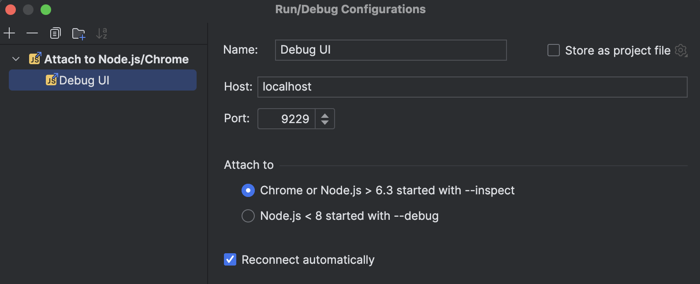

# hmpps-strengths-based-needs-assessments-ui

UI for the Strengths and Needs assessment service.

Libraries this service uses include:
- [GOV.UK Frontend](https://github.com/alphagov/govuk-frontend) for general UI elements and styling
- [MOJ Frontend](https://github.com/ministryofjustice/moj-frontend) for domain specific UI elements and styling
- [HMPO Form Wizard](https://github.com/HMPO/hmpo-form-wizard) for forms based on JSON configuration
- [Jest](https://github.com/jestjs/jest) for unit testing
- [Cypress](https://www.cypress.io/) for end-to-end testing

## Running the service

The service and all of its dependencies are run in [Docker](https://www.docker.com/get-started/) containers.

To start it, run:

`make up`

The entry point for the service is http://localhost:7072

To update containers

`make down update up`

## Development

To install dependencies locally, run:

`make dev-update`

To start the UI in development mode with live-reload enabled, run:

`make dev-up`

A remote debugger can be attached to Node.js on port 9229

Run `make` to see the full list of dev commands.

## Testing

`make lint` to run the linter.

`make lint-fix` to automatically fix linting issues.

`make test` to run the unit test suite.

`make e2e` to run the end-to-end tests in the Cypress app.

## Deployment

Deployments of the main branch to Development -> Preproduction -> Production are automated through the Main workflow in GitHub Actions.

To deploy a branch manually to the Dev or Test environment, go to the Actions tab on GitHub and follow these steps:

1. Select the "Deploy to environment" workflow
2. Click "Run workflow"
3. Select the branch you wish to deploy
4. Select the environment you wish to deploy to
5. Optionally input an image tag (from the Docker registry)
6. Click "Run workflow"

## Maintenance banner

The maintenance banner is controlled by environment variables.

`MAINTENANCE_UNPLANNED=true` will enable the unplanned maintenance banner.

To display a scheduled maintenance banner, define the maintenance window with:
`MAINTENANCE_START_TIMESTAMP_SECONDS=1729947600`
`MAINTENANCE_END_TIMESTAMP_SECONDS=1729954800`

## Service dependencies

* [hmpps-strengths-based-needs-assessments-api](https://github.com/ministryofjustice/hmpps-strengths-based-needs-assessments-api) - backend API
* [hmpps-auth](https://github.com/ministryofjustice/hmpps-auth) - for authentication using OAuth/JWT
* Redis - session store and token caching

